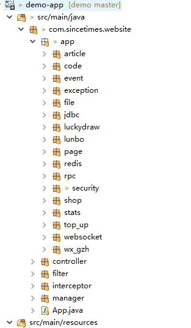
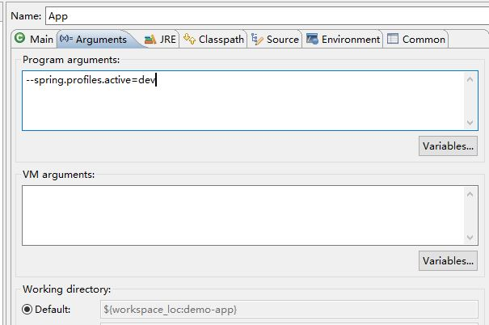
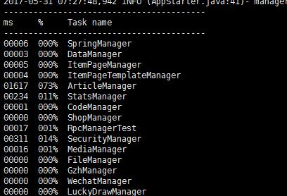

# 开发文档
## 需要提前了解：

序号 | 名称 | 作用 | 程度
---|---|---|---
1 |maven | 项目构建 | 熟
2 |java8 | lamda的,和Stream API |熟
3 |spring boot | 简化spring的使用，简化部署|熟
4 |redis | nosql数据库,支持多种数据结构|熟
5 |thymeleaf | 模板引擎|会用

##  已经有的功能
序号 | 名称 | 作用 | db| 描述| URI
---|---|---|---|---|---
1 |文章编辑 | 富文本编辑 | mysql|网站|/mg/articles
2 |幻灯片 | 轮播图 |redis |网站|/mg/upload_media
3 |自定义模板 | 自定义页面|redis|网站|/mg/page_template
4 |激活码抽奖 | 夺宝,限时红包,微信激活码页面|redis|网站 活动|/mg/code
5 |抽奖(大转盘) | 排行榜,抽奖,通过配置不同属性和条件可以限制抽奖规则|redis|活动|/mg/luckydraw
6 |积分商城 | 排行榜,兑换,签到 | redis|活动|/mg/shop/
## 1.项目结构
  
如图所示为项目依赖关系，  


``` xml
demo-app
    |
    |--demo-core-spring
    |     |
    |     |--demo-core-common
    |     |
    |     |--spring-boot-starter-web
    |     |
    |     |--spring-boot-starter-thymeleaf
    |
    |--demo-core-redis
    |     |
    |     |--demo-core-common
    |     |
    |     |--spring-boot-starter-redis
    |
    |--spring-boot-starter-jdbc
```
如图所示为各个模块

## 2.更新demo-core-parent
 如果修改了demo-core-common或demo-core-spring或demo-core-redis  
 要在demo-core-parent下执行：mvn clean install
```xml
            demo-core-parent
             ↑
             |--demo-core-common
             |--demo-core-spring
             |--demo-core-redis
```

## 3 打包和测试
### 3.1本地测试
#### 3.1.1 直接运行App.java的main函数即可
可以指定参数  

#### 3.1.2 maven命令执行
``` xml
mvn spring-boot:run -D spring.profiles.active=jztpy -D ip=119.29.52.126 -D server.port=8060
```
### 3.2 打包/执行
#### 3.2.1 打包
``` xml
mvn clean package
```
#### 3.2.2 执行
```
java -jar target/XXX.jar
```
或
``` xml
java -jar target/XXX.jar --spring.profiles.active=dev --server.tomcat.basedir=./tmp
```

## 4 日志
### 4.1使用Logback  
  配置文件在各个项目的src\main\resources\logback.xml 
### 4.2 除了LogCore其他项目的其他类不再声明Logger
```
package xxx.xxx.common.support;

import org.slf4j.Logger;
import org.slf4j.LoggerFactory;

public class LogCore{
	public static Logger  BASE = LoggerFactory.getLogger(LogCore.class);
	public static Logger  USER = LoggerFactory.getLogger("USER");
	public static Logger  RECORD = LoggerFactory.getLogger("RECORD");
	public static Logger  CORE = LoggerFactory.getLogger("CORE");
	public static Logger  RPC = LoggerFactory.getLogger("RPC");
}
```
使用
```
		LogCore.BASE.info("first name is {}" , name);

```
## 5 项目启动加载Manager
### 5.1 80%以上的逻辑写在Mananer
web容器启动完后会初始化各个模块的Manager
``` xml
@ManangerInject
public abstract class ManagerBase{
	public static final Map<String, ManagerBase> instances = new ConcurrentHashMap<>();

	@SuppressWarnings("unchecked")
	public static <T extends ManagerBase> T inst(Class<? extends ManagerBase> clazz) {
		Object inst = instances.get(clazz.getName());
		if (null == inst) {
			throw new RuntimeException(Util.format("get the Manager instance fail,class:{}", clazz));
		}
		return (T) inst;
	}

	public static void putInst(Class<?> clazz, Object inst) {
		LogCore.BASE.debug("ManagerBase.putInstances:({},{})", clazz, inst);
		if (!ClassTool.isInstanceof(clazz, ManagerBase.class) || Modifier.isAbstract(clazz.getModifiers())) {// 再次检查
			throw new RuntimeException(Util.format("Manager put inst err,class={}", clazz));
		}
		instances.put(clazz.getName(), (ManagerBase) inst);
	}

	/** 初始化，费时操作 */
	public abstract void init();

}
```


## 6  类的包名作为redis的域
### 6.1 主要接口
```
public interface JedisCallBack<T> {
	T doInRedis(Jedis jedis) throws JedisException;
}
```
### 6.2 JedisWrapper.java 模板
```
public interface JedisWrapper{
	
	JedisPoolTemplate template();
	
	/**可以覆盖此方*/
	default String makeKey(String key) {
		return this.getClass().getCanonicalName().concat(":").concat(key);
	}
	/** Time complexity: O(1) */
	default Boolean exist(String name) {
		return template().excute((jedis) -> jedis.exists(makeKey(name)));
	}
	/*** 查询 **/
	default String get(String name) {
		return template().excute((jedis) -> jedis.get(makeKey(name)));
	}
	。。。
```
要操作redis的Manager要继承JedisManagerBase,其他的组件继承JedisWrapperBase,上线后不可更改类名和所在包名
```
@Component
public abstract class JedisManagerBase extends ManagerBase implements JedisWrapper{

	@Autowired
	public JedisPoolTemplate jedisTemplate;
	
	@Override
	public JedisPoolTemplate template() {
		return jedisTemplate;
	}
}
```
```
@Component
public abstract class JedisWrapperBase implements JedisWrapper{

	@Autowired
	public JedisPoolTemplate jedisTemplate;
	
	@Override
	public JedisPoolTemplate template() {
		return jedisTemplate;
	}
}

```