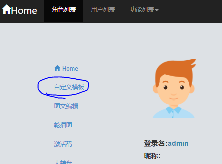
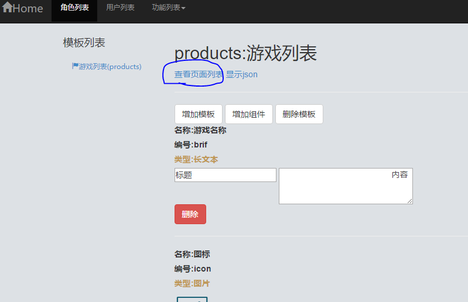
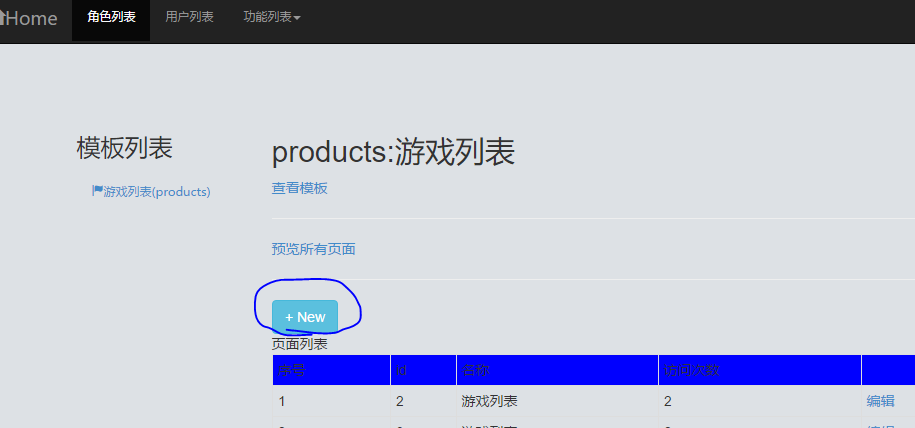

# 自定义模板API  
登录页面 url:(http://demo.williamy.xin/login)
## 1 创建模板和创建页面
### 1.1 登陆后点击`自定义模板`
 
### 1.1 进入模板编辑页面选择`查看页面列表`
 
### 1.1 点击`新建`增加一个页面
 
## 2 获取某个页面
 url:
(http://demo.williamy.xin/page_rst?template_id=products&id=3)  
  
参数说明：
template_id：文章类型ID,创建模板指定的编号
id:自动生成的ID,随着新页面创建自增
 return:
``` json
{
    "id": "2",
    "name": "游戏列表",
    "visits": 4,
    "items": {
        "features": {
            "key": "features",
            "name": "游戏特色",
            "type": "TEXT_AREA_LIST",
            "data": [
                {
                    "data": "《舰指太平洋》以9V9的战斗模式对现代海战进行完美演绎，打造出标新立异的游戏结构，当然玩家也可以自行组建属于自己的无敌航母编队，战舰集群作战，阵容想怎么配就怎么配，我的阵容我做主，更有全方位攻击的地毯轰炸和直捣黄龙的远程打击，根据敌军阵型进行针对性的火力部署。",
                    "name": "独创9V9集群式战舰玩法"
                },
                {
                    "data": "《舰指太平洋》中汇集了苏美英法德意日这7大海军强国在一战、二战期间所有的服役战舰，有德国的无敌巨舰俾斯麦；当然也有英国的荣耀之舰伊丽莎白女王号；意大利的主力战列舰维托里奥级；法国的高射速火炮战列舰黎塞留级；以及苏联海军从沙皇海军手中继承的唯一战列舰甘古特级和日本的大和级战列舰，七国的传奇战舰悉数汇聚。",
                    "name": "完美还原各类战舰，传奇名舰尽数登陆"
                }
            ],
            "createTime": 1492149150492,
            "createTimeStr": null
        },
        "brif": {
            "key": "brif",
            "name": "游戏名称",
            "type": "TEXT_AREA",
            "data": {
                "data": "\t\t\t\t\t\t详细内容\r\n\t\t《舰指太平洋》是由华清飞扬研发的一款军事题材策略卡牌手游，游戏真实还原二战历史，完美再现海上争夺战。在《舰指太平洋》中，不仅有战役、争霸等经典玩法，还有富含变化的勋章、大地图等策略玩法，精彩不容错过！ 值得一提的是，《舰指太平洋》自2016年7月在韩国上线以来，迅速冲进韩国Google Play畅销榜前三，并长期稳定在前十的位置，创国产手游海外发行的新奇迹！\t\t\t",
                "name": "舰指太平洋"
            },
            "createTime": 1492148963083,
            "createTimeStr": null
        },
        "icon": {
            "key": "icon",
            "name": "图标",
            "type": "PICTURE",
            "data": "/upload/pages/2017_04_14/14_15_07_412.png",
            "createTime": 1492148981859,
            "createTimeStr": null
        },
        "downloadurl": {
            "key": "downloadurl",
            "name": "下载链接",
            "type": "TEXT",
            "data": "http://jztpy.sincetimes.com/pc/landing.html",
            "createTime": 1492149055272,
            "createTimeStr": null
        },
        "imagelist": {
            "key": "imagelist",
            "name": "图片列表",
            "type": "PICTURE_LIST",
            "data": [
                "/upload/pages/2017_04_14/14_16_06_961.jpg",
                "/upload/pages/2017_04_14/14_16_14_605.jpg"
            ],
            "createTime": 1492149089194,
            "createTimeStr": null
        },
        "platforms": {
            "key": "platforms",
            "name": "平台",
            "type": "TEXT",
            "data": "android,ios",
            "createTime": 1492149025353,
            "createTimeStr": null
        }
    }
}
```
## 3 文章列表  
- url:(http://demo.williamy.xin/pages_rst?template_id=products)  
 
  
参数说明：
``` xml
template_id：文章类型ID,创建模板指定的编号
```
return:

 
 
---  
## 1 图文编辑
 url:
(https://github.com/WilliamGai/demo/blob/master/demo-app/doc/%E5%9B%BE%E6%96%87%E7%BC%96%E8%BE%91API.md)  
## 2 自定义模板 
 url:
(https://github.com/WilliamGai/demo/blob/master/demo-app/doc/%E8%87%AA%E5%AE%9A%E4%B9%89%E6%A8%A1%E6%9D%BFAPI.md) 

